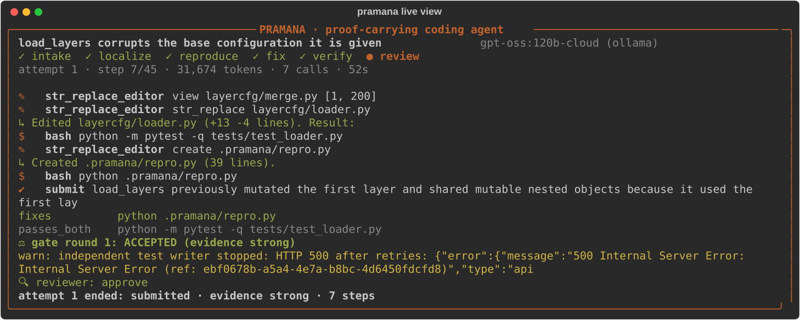

# Pramana

**An autonomous coding-agent harness whose patches carry their own proof.**

*Pramāṇa* (Sanskrit): a means of valid knowledge, i.e. evidence. Every change Pramana makes is
re-executed against the **original** code and the **patched** code, so a fix comes with a
fail→pass demonstration instead of a claim. Same model as everyone else; the harness does the
engineering.

```bash
export AI_API_KEY="<key>"     # provider auto-detected from the key (DeepSeek, OpenAI, Anthropic, Gemini, NVIDIA, Qwen, Groq, OpenRouter, ...)
export AI_MODEL="<model id>"  # optional: the prescribed model (AI_BASE_URL for any other OpenAI-compatible endpoint)
make setup                    # installs into ./.venv (uv if present, else venv + pip)
make run                      # opens Pramana Studio (the app): say what's wrong in plain words + the repo; make tui = terminal version
make test                     # offline unit tests + (with a key) the end-to-end benchmark with hidden tests
```

**Pramana Studio** opens as its own window: one box takes plain words, a GitHub issue link or `owner/repo#N`; the repository can be a GitHub URL,
`owner/name` or a local folder (a GitHub link in the text is enough). It shows live progress, the proof (original vs patched), the diff and
the report, and says which API, endpoint and model it is using. On a machine without a display, `make run` serves the app and runs the
terminal version in the same session.

Non-interactive: `make run REPO=/path/or/git-url ISSUE=https://github.com/o/r/issues/123 TEST="pytest tests/test_x.py"`
(the issue can also be piped on stdin).

Several issues at once: give the repo and say "fix #3, #5 and #8" (or "fix the open issues" and tick them). Each issue gets its own
clone and branch and runs in parallel under one shared rate limiter; the Studio shows a live clock, what every issue is doing and
where its seconds went (model / tools / proof). Proven fixes can become pull requests one by one, or automatically. Stop ends
everything at once (button, ⌘., or `make stop`). Every run is logged under `runs/`.



---

## How it works

```
 issue ──▶ Intake ──▶ Zero-token repro ──▶ Localize ──▶ Acceptance ──▶ Agent loop ──▶ Submit gate ──▶ Independent ──▶ Reviewer ──▶ Evidence
          repo scan,  run the issue's      traceback,   criteria       (one context,  every check    test writer    predicts     bundle +
          lang/tests, code snippets on     paths,       (maintainer's  7 tools, loop  run on the     (blind agent,  maintainer's  run index
          env probe   the ORIGINAL code    symbols,     checklist,     & budget       ORIGINAL and   never sees     test, checks
                      (traceback feeds     BM25, test   1 call)        guards)        PATCHED code   the patch)     the diff
                      localization)        imports                                    │                             │
                                                                                      └── rejected → back to agent ◀┘
                                           attempt 2 (fresh context + lessons) only if attempt 1 ends without proof
```

### Fast path: small issues in one call, big ones get the whole harness

A zero-token triage sizes the issue (small / medium / large). Small and medium issues first get **one call** that must return the
edits **and** a test that fails on the original code; the same submit gate runs it on the original and the patched code. Only a
fail→pass result is accepted. A second round carries the exact reason the first was not accepted; anything still unproven
escalates to the full agent with those lessons. On a 10-issue repository this took all ten to **verified in 6 min 52 s with 54
calls** (the full-agent pipeline alone: 8/10 in ~11.5 min with ~204 calls).

Measured failure modes of one-shot answers on real repositories are handled, and each only acts when something failed, so the
easy path is unchanged: an edit the model repeated verbatim is applied once; SEARCH text that is a near miss (≥ 90 % similar, one
region, the changed lines themselves exact) lands on the real code with the file's own context kept; a wrong file path is resolved
from the SEARCH text; a reply cut off mid-reasoning gets one "final answer now" call instead of spending a round; and a test that
fails even with the fix is named as a broken test. A change that only touches docs, config or CI files is reported as a patch to
review, never as verified, and an empty patch is never verified.

### Five layers of evidence, every one of them executed

| # | layer | what runs | what it proves |
|---|---|---|---|
| 1 | **issue snippet** | code blocks from the issue, run on the original code before the model's first turn | the bug is real here; the traceback seeds localization (0 model tokens) |
| 2 | **agent reproduction** | the agent's script, run by the harness on original **and** patched code | fail → pass |
| 3 | **related existing tests** | test files for every changed module, selected automatically (the agent cannot skip them) | pass → pass (no regression) |
| 4 | **independent regression test** | written by a *second* agent that sees only the issue, never the patch | the fix satisfies the issue as a maintainer would test it, not just the agent's own reading |
| 5 | **reviewer** | fresh-context review that first predicts the maintainers' regression test, then checks the diff against it | root cause, sibling cases, unchanged behaviour |

A check that passed on the original code but fails with the patch is a **regression** and the
submission is returned with the failure output; a reproduction or independent test that still fails
is returned the same way. Pre-existing failures (fail → fail in unrelated tests) are recognised and
ignored, and the agent can ask the same question at any time with the `compare` tool.

### The agent-computer interface

- **`str_replace_editor`** accepts near-misses safely: pasted line numbers, trailing whitespace and
  a different indentation scheme are tolerated (re-indented level by level), but only for a
  **unique** match. On a miss it shows the most similar region with line numbers. **Lint gate:** an
  edit that would make a Python/JSON/JS/TOML file unparseable is rejected with the exact error.
  Editing back to an earlier version of a file is detected and called out (oscillation).
- **`compare`** runs any command on the original and on the current code and says *fixed /
  regression / pre-existing*: the antidote to agents that "fix" unrelated failing tests.
- **`search`**, **`find_definition`**, **`find_files`**: ripgrep → `git grep` → Python fallbacks;
  symbols via Python `ast`, universal-ctags or regex; results grouped and capped.
- **`bash`**: own process group, timeout, closed stdin, head+tail truncation, the target repo's
  virtualenv activated, a `python`→`python3` shim where needed, a denylist (sudo, `git push`,
  `rm -rf /`, ...), and the model's API key scrubbed from the environment.
- Argument tolerance: every common spelling of a line range (`view_range`, `line_start/line_end`,
  `start/end`, `offset/limit`, `"120-250"`), alias tool names (`view`, `create`, `execute_bash`,
  `functions.bash`, ...), and tools inferred from argument shape. Unknown arguments are never
  ignored silently: the result says which ones were ignored.

### Model robustness

Native tool calling where available; automatic switch to a text protocol when an endpoint rejects
tools; tool calls written as text (XML, `<invoke>`, Hermes, Qwen, JSON) are recovered, and
anything a model "imagines" after its calls (self-written results) is discarded. Unsupported
parameters are dropped and remembered (`temperature` on reasoning models, `max_tokens` vs
`max_completion_tokens`, ...). 5xx errors get retries that *perturb* the request (some endpoints
fail deterministically on one transcript). Thinking models get their reasoning passed back
(DeepSeek-style APIs reject a tool conversation without every turn's `reasoning_content`; the field
name is negotiated). Context overflow triggers compaction. Requests share a per-endpoint limiter
that backs off once per burst of 429s and recovers on its own; an endpoint that stops answering
ends the run with a clear message instead of hanging.

### Keeping the agent on track

The harness watches the trajectory and intervenes with short notes: repeated identical calls,
repeated failed edits on one file, editing a file back to a version it already had, many steps with
no source change, running the whole test suite (where failures are usually pre-existing), writing
throwaway `python -c` probes instead of one reusable reproduction file, and the step budget
running low.

The strongest of these is the **harness checkpoint**, which costs no model tokens: once the agent
has edited source and run something successfully, the harness re-runs its commands on the original
and patched code itself. If the change *already* carries proof, it tells the agent so and asks it to
submit instead of exploring further. On one bundled task this cut a run from 26 steps to 15 with the
same verified result; across a SWE-bench subset it cut mean tokens per task by ~17% at equal
resolve rate.

### Efficiency

Append-only transcript (provider prompt caching works) until the prompt crosses a threshold, then
one batch compaction; file views made stale by an edit are elided immediately (their line numbers
are wrong anyway); long pasted logs and package lists in an issue are condensed once at intake
rather than re-sent every turn. Second attempts, the independent test writer and the reviewer only
run when the evidence calls for them. Every run reports tokens (input / cached / output), model
calls and wall time.

## Measured results

Everything below was produced by this repository; the harness is graded by tests it never sees.

**Live open issues on real projects** (2026-09-27) — 13 open bug reports, each first reproduced on the project's current default
branch, run all at once with `nvidia/nemotron-3-super-120b-a12b` (free tier). Every verified fix was then read by a person and
its project's full test suite run with it:

| project | verified | review of the verified fixes |
|---|---|---|
| `Textualize/rich` (57k★) | **6/6** (154–740 s each) | 5 merge-quality (no new failures in Rich's ~950 tests); #3643 works but changes a default |
| `arrow-py/arrow` (9k★) | **1/2** | #1124 merge-quality (1902/1902 tests), submitted upstream as [arrow-py/arrow#1364](https://github.com/arrow-py/arrow/pull/1364) with a regression test |
| `andialbrecht/sqlparse` (4k★) | **1/5** | #779 fixes the report but changes how `GRANT … ON a, b TO role` groups, which no existing test covers |

The other five (sqlparse parser bugs, an arrow humanize bug) were stopped after 33–77 calls without a proof. "Verified" means
proven by execution; review found 2 of the 8 not merge-ready, which is why the evidence bundle shows the checks rather than a
verdict alone.

**SWE-bench Verified** (real GitHub issues, graded by their hidden `FAIL_TO_PASS` + `PASS_TO_PASS`
tests) — 19-instance stratified sample, run locally without Docker through the same code path as
`make run`. Reproduce with [`bench/swebench/`](bench/swebench/).

| repository | resolved | mean tokens / task | mean wall / task |
|---|---|---|---|
| `django/django` | **5/9** | 1155k | 668s |
| `pytest-dev/pytest` | **3/4** | 1105k | 437s |
| `sympy/sympy` | **3/6** | 496k | 214s |
| **total** | **11/19 (58%)** | 936k | 476s |

Model: `gpt-oss-120b` (a free open-weights endpoint, not a frontier model) at temperature 0.
Token counts are raw; on a provider with prompt caching most input tokens are cache reads.
Honest caveats: 19 instances is a small sample; it is drawn from the repos that install cleanly
without Docker; an environment counts only if the *official* patch passes its tests here (that
check excludes `psf/requests`, which needs network access, and `pallets/flask`); and individual
instances flip between runs — repeated runs of the same 10-instance subset scored 5, 6 and 6 —
so treat single-instance differences as noise and the rate as approximate.

The same harness scales with the model. Three of those instances were re-run with
`claude-sonnet` (through the text tool protocol, since that backend has no native tool calling):

| instance | `gpt-oss-120b` | `claude-sonnet` |
|---|---|---|
| `sympy__sympy-15345` | failed 3 runs (fixed `Max`, missed `Min`) | **resolved**, verified |
| `pytest-dev__pytest-10051` | failed 3 runs (worked around the cause) | **resolved**, verified |
| `django__django-17087` | resolved | **resolved**, verified |

**Bundled benchmark** (`make bench`) — 4 tasks with hidden tests: two Python bug fixes, a
JavaScript bug fix, and a feature request.

| model | tool calling | resolved | tokens | wall |
|---|---|---|---|---|
| `claude-sonnet` | text protocol | **4/4** | 335k | 439s |
| `gpt-oss-120b` | native | **4/4** | 296k | 616s |
| `gemma4` | native | **4/4** | 487k | 306s |
| `gemma4` | forced text protocol | **1/1** (`slugify`) | 81k | 92s |

Three model families, both tool-calling styles, same harness and same tasks. On the Claude run the
blind independent test writer produced a passing regression test for all four tasks, each one
failing on the original code and passing on the patch.

**Offline tests** (`make test`, no API key): 60 tests. Unit coverage for the fast path (one-call fixes, repeated and near-miss
edits, cut-off replies, new files kept, config-only changes not verified), the rate limiter and Stop, the editor's tolerant
matching, lint gate and CRLF/BOM preservation; the submit gate's fail→pass / regression
classification; git patch isolation; the text tool protocol; tool-name and argument
canonicalisation; localization; dependency-stub rejection; and both provider wire formats against a
fake HTTP server (retries, parameter negotiation, message ordering, Azure paths).

Six of them run the **whole agent against deliberately hostile endpoints**, because the evaluation
model is not known in advance: an endpoint that rejects tool calling (the harness falls back to the
text protocol and still lands a verified fix), one that returns HTML garbage and 429s mid-run, a
context window too small for the prompt (the harness shortens the task description and still
finishes), a context window too small to be workable at all (it stops cleanly, leaves the
repository untouched and still writes a report), and a model that never calls a tool.

## Evidence bundle

Every run writes `runs/<timestamp>-<issue>/`:

| file | contents |
|---|---|
| `report.md`, `report.html` | verdict, root-cause summary, before/after table, diff, tokens, attempts |
| `patch.diff` | the change, `git apply`-able |
| `evidence.json` | machine-readable: checks, verdicts, usage, timings, config (never the key) |
| `trajectory.jsonl` | every model call, tool call and tool result |
| `transcript_attemptN.json` | the full conversation per attempt |
| `scratch/` | the agent's reproduction scripts |

The target repository is left with **only the fix** applied (scratch files are moved into the
bundle).

## Model configuration

`pramana.toml` holds the model configuration; the credential only ever comes from `AI_API_KEY`.

| key prefix | provider | default model (override with `[model] name` or `AI_MODEL`) |
|---|---|---|
| `sk-ant-` | Anthropic (native tool use + prompt caching) | `claude-sonnet-5` |
| `AIza` | Gemini (OpenAI-compatible endpoint) | `gemini-2.5-flash` |
| `gsk_` | Groq | `openai/gpt-oss-120b` |
| `sk-or-` | OpenRouter | `openai/gpt-oss-120b` |
| `xai-`, `nvapi-`, `csk-`, `hf_`, `fw_`, `tgp_` | xAI, NVIDIA, Cerebras, Hugging Face, Fireworks, Together | see `pramana/config.py` |
| `sk-proj-`, `sk-svcacct-`, `sk-admin-` | OpenAI | `gpt-5-mini` |
| `sk-` (plain) | probed: DeepSeek, OpenAI, Moonshot, DashScope (the first that accepts the key) | that provider's coding model, e.g. `deepseek-flash` |
| anything else | any OpenAI-compatible endpoint: set `AI_BASE_URL` (+ `AI_MODEL`) | |

Azure OpenAI is detected from the URL (or `AI_PROVIDER=azure`): it authenticates with the `api-key`
header and builds the `/openai/deployments/<AI_MODEL>/chat/completions?api-version=...` path
(override with `AI_API_VERSION`). A local dev backend that drives an already-signed-in Claude Code
CLI is available with `AI_PROVIDER=claude-cli`; it needs no key and is useful for development.

If the Organising Committee prescribes a model, set `name` in `pramana.toml` (or `AI_MODEL`);
nothing else changes. `make doctor` checks connectivity and whether native tool calling works.
Runs are deterministic where the provider allows it (temperature 0, fixed seed).

## Layout

```
pramana/
  cli.py                 make run / solve / doctor / bench
  config.py              pramana.toml + env, provider detection
  llm/                   OpenAI-compatible, Anthropic, text protocol, (dev) Claude CLI, mock
  tools/                 shell, editor (tolerant matching + lint gate), search, tool schemas
  repo/                  intake, git tracking, symbols, localization, issue fetching, env bootstrap
  agent/                 prompts, loop, submit gate, context manager, orchestrator
  report/                evidence bundle writer
  ui/                    live terminal view
  web/                   Pramana Studio (the app: single runs, batches, pull requests, history)
bench/tasks/             end-to-end tasks with hidden tests (make test)
tests/                   offline unit tests
```
